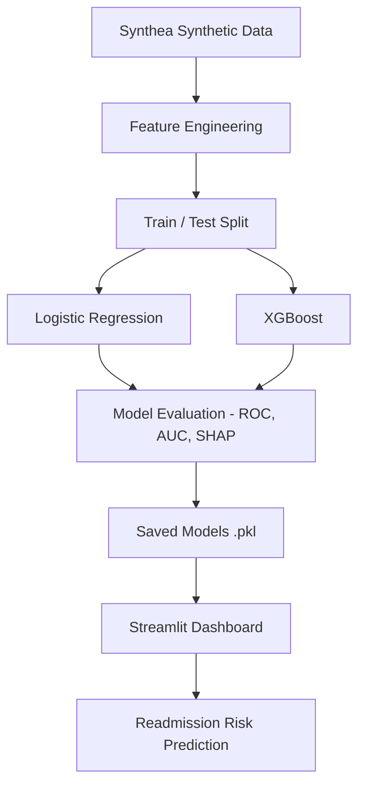
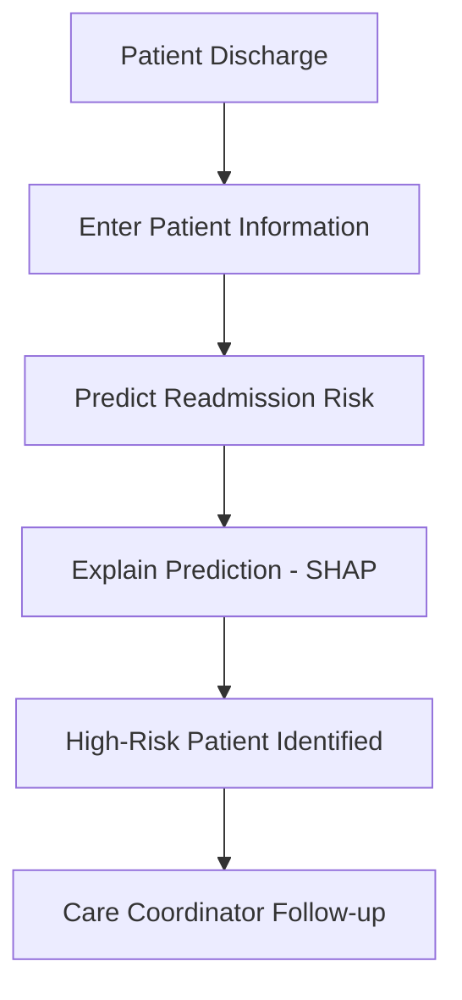

# 30-Day Hospital Readmission Risk Predictor

**Clinical AI Portfolio Project | Explainable Machine Learning for Readmission Risk Prediction**

[](https://readmission-risk.streamlit.app)
[](https://github.com/KarkiAi/readmission-risk-predictor)

> Predicts 30-day hospital readmission risk using synthetic patient data, machine learning, and explainable AI (SHAP).

> **Current Version:** v2.1

> **For educational and portfolio purposes only. Not intended for clinical use.**

---

# Overview

Hospital readmissions are a major quality and cost concern in healthcare. This project demonstrates an end-to-end Clinical AI workflow that predicts a patient's likelihood of being readmitted within 30 days after discharge.

Using **Synthea synthetic inpatient data**, the project develops and compares Logistic Regression and XGBoost models, applies SHAP explainability, and deploys an interactive Streamlit dashboard that provides patient-level risk predictions and feature-level explanations.

This project demonstrates:

- Clinical feature engineering
- Explainable AI (SHAP)
- Model comparison
- Clinical decision support concepts
- Streamlit deployment
- Healthcare-focused machine learning workflow

---

# Live Demo

**Streamlit App**

https://readmission-risk.streamlit.app

**GitHub Repository**

https://github.com/KarkiAi/readmission-risk-predictor

---
# Solution Architecture


# Dashboard Preview

**Home / Default View**


**High-Risk Patient Prediction**


---

# Model Performance

| Model | v1.0 | v1.1 | v2.0 | v2.1 |
|--------|------|------|------|------|
| Logistic Regression | 0.850 | 0.938 | **0.950** | 0.933 |
| XGBoost | 0.750 | 0.856 | 0.856 | **0.967** |

Current dataset:

- 94 adult synthetic inpatient encounters
- 12 engineered features
- Adult-only cohort (Age ≥ 18)

---

# Example High-Risk Patient

**Predicted Readmission Risk:** XGBoost 99.6% | Logistic Regression 94.6% (High Risk)

| Feature | Value |
|----------|------|
| Age | 76 |
| Sex | Male |
| Length of Stay | 6 days |
| Taking 5+ Medications | Yes |
| Active Conditions | 81 |
| High-Risk Diagnosis | Yes (CHF/COPD/Diabetes/CKD) |
| Prior Inpatient Stays | 5 |
| Prior Visits (6 Months) | 6 |
| Emergency Visits (6 Months) | 2 |
| Low Income | Yes |
| Married | Yes |
| Social Isolation | Yes |

---

# LACE Index (Clinical Baseline)

Alongside the ML predictions, the dashboard calculates the LACE Index — a widely used clinical readmission risk score based on Length of stay, Acuity of admission, Comorbidities, and Emergency visits in the prior 6 months.

This is displayed as a clinical baseline for comparison, not as a replacement for the ML output. **Note:** the Comorbidity (C) component here is approximated using active condition count. The original, validated LACE index uses the Charlson Comorbidity Index for this component — this app's version is a simplified stand-in, not a clinical-grade implementation, and is disclosed as such in the app itself.

---

# Feature Importance & Explainability

**Global Feature Importance (SHAP summary across all test patients)**

The Colab notebook generates a SHAP summary plot showing which features matter most across the full test set — PRIOR_INPATIENT_TOTAL, CONDITION_COUNT, and LENGTH_OF_STAY consistently rank highest.

**Patient-Level Explanation (SHAP values for an individual prediction)**

The live app displays a SHAP table for each specific patient, showing which features pushed that individual's risk score up or down.

The global view shows which features matter most across the population. The patient-level view shown in the live app explains why a specific individual received their specific risk score — the two are complementary, not interchangeable.

# Features Used

| Feature | Category |
|----------|----------|
| AGE_AT_ENCOUNTER | Clinical |
| LENGTH_OF_STAY | Clinical |
| GENDER_ENCODED | Demographic |
| POLYPHARMACY | Clinical |
| CONDITION_COUNT | Clinical |
| HIGH_RISK_CONDITION | Clinical |
| PRIOR_VISITS_6MO | Utilization |
| PRIOR_INPATIENT_TOTAL | Utilization |
| EMERGENCY_VISITS_6MO | Utilization |
| LOW_INCOME | SDOH |
| MARITAL_ENCODED | SDOH |
| SOCIAL_ISOLATION | SDOH |

Previous versions evaluated WINTER_DISCHARGE and HIGH_PROCEDURE_BURDEN. These features were removed after feature importance analysis and ablation testing showed no improvement in predictive performance.

---

# Key Findings

- Prior inpatient utilization remained the strongest predictor across all model versions.
- XGBoost achieved the best overall performance in Version 2.1 (AUC = 0.967).
- Low income and emergency department utilization demonstrated associations with readmission risk within the synthetic dataset.
- SHAP explainability provides transparent patient-level reasoning for every prediction.
- Simplifying the feature set improved interpretability while maintaining predictive performance.

---
# Clinical Workflow



# Clinical Implications

Patients identified as high risk could benefit from targeted post-discharge interventions such as:

- Early follow-up appointments
- Medication reconciliation
- Care coordination
- Social work referral
- Chronic disease management

This project illustrates how explainable AI can support—not replace—clinical decision-making.

---

# Tech Stack

- Python
- pandas
- scikit-learn
- XGBoost
- SHAP
- Streamlit
- Synthea
- matplotlib
- joblib
- Git
- GitHub

---

# Project Structure

```
readmission-risk-predictor/
├── app/
│   └── app.py
├── models/
│   ├── xgb_readmission_v21.pkl
│   └── lr_readmission_v21.pkl
├── notebooks/
├── data/
├── requirements.txt
└── README.md
```

# Changelog

## v2.1 (Latest)

- Adult-only cohort (age ≥ 18); removed 7 pediatric encounters
- Added SOCIAL_ISOLATION feature — 100% of readmitted patients had documented social isolation vs. 64% of non-readmitted
- Removed WINTER_DISCHARGE — weak signal on synthetic data
- Removed HIGH_PROCEDURE_BURDEN — confirmed zero AUC impact via controlled test (0.856 with vs. without), 74% prevalence made it non-discriminating
- Tested class_weight='balanced' on Logistic Regression — identical results to default; not adopted
- Tested ensemble voting (either model flags HIGH) — added 1 false alarm, 0 additional true positives caught; not adopted
- Added LACE Index as a clinical baseline displayed alongside ML predictions
- XGBoost AUC improved from 0.856 to 0.967, outperforming Logistic Regression for the first time across all versions
- Dataset refined to 94 adult encounters

## v2.0

- Added SDOH variables (income, emergency utilization, marital status)
- Expanded from 8 → 13 features
- Added procedures dataset
- Improved Logistic Regression AUC to 0.950

## v1.1

- Removed MED_COUNT after SHAP identified out-of-distribution failure on cumulative medication counts
- Added POLYPHARMACY binary flag as a more stable substitute
- AUC improved: LR 0.850 → 0.938, XGBoost 0.750 → 0.856

## v1.0

- Initial release: XGBoost and Logistic Regression on 101 Synthea encounters
- SHAP explainability integrated
- Deployed to Streamlit Community Cloud

---

# Roadmap

**Completed**

- Initial ML pipeline
- SHAP explainability
- Streamlit deployment
- Adult cohort refinement
- LACE baseline comparison

- **Planned**

- External validation dataset
- Fairness evaluation across demographic subgroups
- Model calibration
- Real-time clinical data ingestion (moving beyond manual input)
- Improve deployment reliability and reproducibility
- Add automated checks before deployment

---

# Limitations & Ethical Considerations

## Technical Limitations

- Developed using Synthea synthetic data - not real patient data
- Small sample size (94 adult encounters)
- Simplified LACE Index implementation - Comorbidity (C) component approximated from condition count rather than the validated Charlson Comorbidity Index
- Requires external validation using real-world clinical data before any clinical use
- Intended solely as a portfolio demonstration

## Ethical Considerations

Healthcare AI systems should support — not replace — clinical judgment.

Features associated with healthcare utilization may reflect underlying socioeconomic disparities rather than patient risk alone. Transparent model explanations and fairness evaluation are essential before deployment in clinical settings.

Because Synthea generates synthetic populations, subgroup fairness analysis is limited and should not be interpreted as representative of real-world healthcare populations.

---

# Author

**KarkiAi**

github.com/KarkiAi


